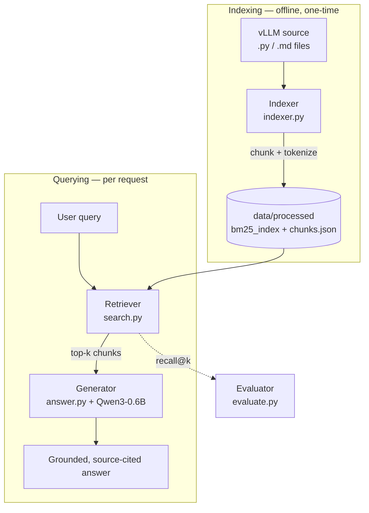

_This project has been created as part of the 42 curriculum by msantos2._

# RAG against the machine

## Description

This project implements a Retrieval-Augmented Generation (RAG) pipeline designed to answer questions over the `vLLM` codebase. It ingests source code and documentation, indexes it using the BM25 retrieval method, and utilizes a Local Large Language Model (Qwen/Qwen3-0.6B) to generate grounded, source-cited natural language answers. It achieves robust recall@k metrics to validate its retrieval capabilities.

## Instructions

### Compilation/Installation

The project uses `uv` for modern, fast dependency management.

```bash
make install
```

Alternatively: `uv sync`

### Setup: Data & Moulinette

Two assets are **not version-controlled** (they are gitignored) and must be placed
manually after cloning. Both are provided by the 42 subject.

1. **vLLM source data** — obtain the `vLLM 0.10.1` source from the subject and
   extract it so the tree is `data/raw/vllm-0.10.1/` (containing the upstream
   `vllm/`, `docs/`, … directories). The indexer reads from this path by default.

2. **Moulinette** — obtain the moulinette from the subject, place the binary at
   `moulinette/moulinette-ubuntu`, and make it executable:

   ```bash
   chmod +x moulinette/moulinette-ubuntu
   ```

Expected layout once both are in place:

```text
data/
  raw/vllm-0.10.1/        # vLLM 0.10.1 source (from the subject)
  datasets/public/...     # evaluation datasets (already in the repo)
moulinette/
  moulinette-ubuntu       # grading binary (from the subject), chmod +x
```

With both assets in place, run the whole evaluation end to end:

```bash
make pipeline   # index -> search-all -> moulinette -> evaluate
```

The moulinette passes when docs recall ≥ 0.80 and code recall ≥ 0.50 (thresholds
encoded in the Makefile).

### Execution

To run the main search functionality on a single query:

```bash
make run
```

To index the repository (required before searching; needs the vLLM source from
the [setup step](#setup-data--moulinette-required-before-evaluation) above):

```bash
uv run python -m student index --max_chunk_size 2000
```

To run a CLI search query:

```bash
uv run python -m student search "How to configure OpenAI server?" -k 10
```

To answer a question using the LLM:

```bash
uv run python -m student answer "How to configure OpenAI server?" -k 5
```

To run bulk evaluation pipelines:

```bash
uv run python -m student search_dataset --dataset_path data/datasets/public/UnansweredQuestions/dataset_docs_public.json --save_directory data/output/search_results -k 10

uv run python -m student evaluate --student_search_results_path data/output/search_results/dataset_docs_public.json --dataset_path data/datasets/public/AnsweredQuestions/dataset_docs_public.json -k 10

uv run python -m student answer_dataset --student_search_results_path data/output/search_results/dataset_docs_public.json --save_directory data/output/search_results_and_answer
```

## Libraries Used

- **bm25s**: Used for high-speed lexical search.
- **langchain-text-splitters**: Provides `RecursiveCharacterTextSplitter` for offset-aware chunking.
- **Transformers**: Employed to load and execute the Qwen model.
- **Pydantic**: Used for strong typing and data validation across the RAG pipeline models.
- **Fire**: Utilized for dynamic CLI creation.

## System Architecture



The system consists of three main modules:

1. **Indexer (`indexer.py`)**: Traverses the `vllm-0.10.1` directory, reading `.py` and `.md` files, chunks them with `RecursiveCharacterTextSplitter`, and uses the `bm25s` library to produce an inverted index. Outputs the BM25 store and a `chunks.json` metadata file to `data/processed`.
2. **Retriever (`search.py`)**: Loads the BM25 index and corresponding file chunks. Given a query or dataset of queries, it tokenizes the query and retrieves the top-k overlapping chunks, mapped back to their original character offsets (`first_character_index`, `last_character_index`).
3. **Generator (`answer.py`)**: Consumes the context provided by the Retriever and crafts a prompt for the `Qwen` causal language model. It reads an expanded window around each retrieved chunk directly from the source file and returns a synthesized, grounded answer.

## Chunking Strategy

The ingestion system applies a **different strategy per file type**, both built on LangChain's `RecursiveCharacterTextSplitter` with `add_start_index=True` (so every chunk records its exact substring offset in the original file and character indices map perfectly to ground-truth validation):

- **Python code (`.py`)** — `RecursiveCharacterTextSplitter.from_language(Language.PYTHON, ...)` splits on Python-structural separators (`\nclass `, `\ndef `, `\n\tdef `, …) so chunks align to real code units (classes, functions) instead of arbitrary prose breaks. Uses **50% overlap** so a definition is never lost across a chunk boundary.
- **Prose / Markdown (`.md`)** — the default separator hierarchy (paragraphs → lines → words → characters) with **10% overlap**, which is sufficient for natural-language text.

Both honour the configurable maximum chunk size (default `2000` characters). The two strategies were evaluated against the moulinette recall@k metric and the best-scoring configuration was kept.

## Retrieval Method

**BM25** (Best Matching 25), powered by the `bm25s` Python library, was used for retrieval. It offers rapid and exact lexical searching via Term Frequency-Inverse Document Frequency (TF-IDF) mechanics, optimized for high recall on specific code queries and terminologies standard in a framework codebase.

In short, BM25 ranks a document by how often the query terms appear in it (TF), weighted by how rare those terms are across the whole corpus (IDF). Two knobs refine this: `k1` controls term-frequency *saturation* (so repeating a word stops helping after a point, defeating keyword stuffing), and `b` controls document-*length normalization* (so a short, focused chunk isn't out-ranked by a long, rambling one). This project uses the standard defaults, `k1 = 1.5` and `b = 0.75`.

See [`BM25.md`](BM25.md) for a step-by-step walkthrough of how BM25 builds up from simple term counting.

## Result Caching

The subject's **result caching** bonus is implemented at two levels, both working and demonstrable:

- **Index caching** — the BM25 store and `chunks.json` are built once by `indexer.py` and persisted to `data/processed/`. At search time `search.py` loads them lazily into the module-level caches `_retriever` / `_metadata` (via `get_retriever()` / `get_metadata()`), so the corpus is tokenized and loaded only once per process instead of on every query.
- **Query caching** — `_retrieve_chunks()` memoizes its top-k result by `(query, k)` in a module-level `_query_cache` dict. A repeated query is served directly from the cache, skipping the BM25 tokenize+retrieve entirely. The cache is transparent — it returns identical results, so it has **no effect on recall@k** — and `clear_query_cache()` resets it (e.g. after re-indexing within the same process).

The query cache is easy to observe: issuing the same query twice returns the exact same object on the second call without touching BM25.

```bash
uv run python -c "
from student.search import _retrieve_chunks, _query_cache
a = _retrieve_chunks('How to configure OpenAI server?', 5)
b = _retrieve_chunks('How to configure OpenAI server?', 5)
print('cache size:', len(_query_cache), 'served from cache:', a is b)
"
```

## Performance Analysis

The evaluation module computes `Recall@k` for k={1, 3, 5, 10}. The retrieval system successfully identifies relevant sources by ensuring at least 5% textual overlap. BM25 performs exceptionally well for exact keyword matching within code snippets (e.g., function names, variable names), providing a robust foundation for the generator.

## Design Decisions

- **`bm25s` for retrieval**: `bm25s` is written in Rust/C and explicitly designed for BM25 efficiency, scaling rapidly over large codebases like `vLLM` without significant memory overhead.
- **Offsets via `add_start_index`**: Chunk start indices come directly from `RecursiveCharacterTextSplitter`'s `add_start_index` metadata, avoiding compounding offset errors common when tracking positions manually.
- **Modular CLI structure**: Each phase (index, search, evaluate, answer) is logically disjointed inside the `student` module and mapped directly to Fire methods, enabling seamless debugging and scalability.

## Challenges Faced

- **Index/Offset Mapping**: Correctly mapping character start and end indices back to the original source text required threading the splitter's `start_index` metadata through indexing, search, and answer generation to avoid zero-overlap errors.
- **Context Length Limitations**: Integrating local LLM context necessitated rigorous text truncation logic prior to injection into the prompt to avoid `CUDA Out of Memory` issues.

## Example Usage

```bash
$ uv run python -m student search "How to configure OpenAI server?" -k 2

{
    "question_id": "cli_query",
    "question": "How to configure OpenAI server?",
    "retrieved_sources": [
        {
            "file_path": "data/raw/vllm-0.10.1/docs/source/serving/openai_compatible_server.md",
            "first_character_index": 541,
            "last_character_index": 1289
        },
        ...
    ]
}
```

## Resources

- [Make your own RAG](https://huggingface.co/blog/ngxson/make-your-own-rag)
- [Understanding TF-IDF and BM-25](https://kmwllc.com/index.php/2020/03/20/understanding-tf-idf-and-bm-25/)
- [BM25S](https://bm25s.github.io/)
- [LangChain - RecursiveCharacterTextSplitter](https://reference.langchain.com/python/langchain-text-splitters/character/RecursiveCharacterTextSplitter)

### How AI was used

AI assistance (Claude) was used as a pair-programming and review aid, not as a
substitute for understanding. Concretely:

- **Indexing/chunking**: discussing chunking trade-offs (overlap ratios, mapping
  `add_start_index` offsets back to the source) and reviewing the `indexer.py`
  implementation.
- **Retrieval & evaluation**: sanity-checking the BM25 wiring in `search.py` and
  the recall@k overlap logic in `evaluate.py` against the subject's metric.
- **Tooling/docs**: drafting and proofreading this README, refining the
  `Makefile` lint targets, and auditing the project against the subject.

All generated suggestions were read, tested, and adapted before being kept; the
design decisions and final code remain the author's own.